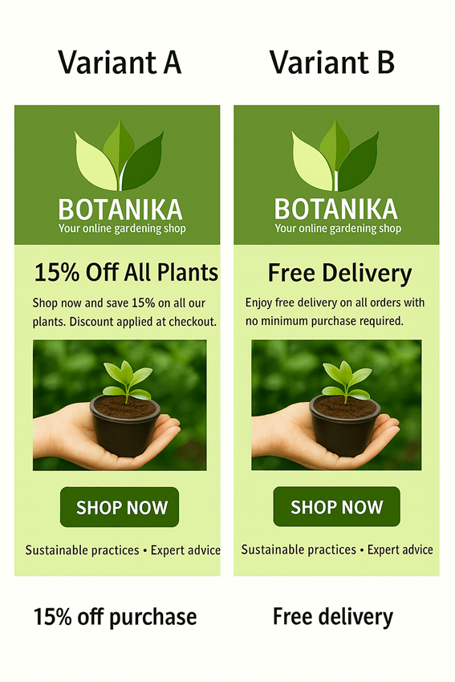

# A/B Testing in E-Commerce: Free Delivery vs. Discount Campaign

## Overview

This project simulates a complete end-to-end A/B testing workflow for BOTANIKA, a fictional online gardening shop.
The experiment compares two email marketing strategies to determine which drives more conversions and revenue:

Variant A – 15% Discount on all plants

Variant B – Free Delivery on all orders

The project demonstrates how statistical rigor and business reasoning can be combined to support data-driven marketing decisions.

---

## Experiment Design

| Element              | Description                                                                |
| -------------------- | -------------------------------------------------------------------------- |
| **Objective**        | Identify which campaign increases conversion rate and revenue per customer |
| **Primary Metric**   | Conversion Rate (share of users making ≥1 purchase)                        |
| **Secondary Metric** | Revenue per User (net of promo costs)                                      |
| **Guardrails**       | Promo Cost/User (discount + shipping waived)                               |
| **MDE / Power**      | Detect +2pp absolute lift at α=0.05, Power=0.8                             |
| **Sample Size**      | 25,000 users equally split across A/B                                      |
| **Data**             | Synthetic but realistic e-commerce data (customer & sales behavior)        |
Note:
While statistical tests can never eliminate uncertainty completely, this experiment uses a robust design and multiple validation layers—randomization checks, CUPED variance reduction, and Bayesian inference—to ensure reliable conclusions.

---

## Analytical Methods

| Method                         | Purpose                                                                        |
| ------------------------------ | ------------------------------------------------------------------------------ |
| **Frequentist Tests**          | z-test (Conversion), Welch t-test (Revenue), 95% Confidence Intervals          |
| **CUPED**                      | Variance reduction using pre-period behavior (pre_orders_30d, pre_revenue_30d) |
| **Bayesian Inference**         | Posterior probability Pr(B > A), 94% HDI                                       |
| **Segmentation**               | Cluster-based heterogeneity analysis (Forest Plot)                             |
| **Guardrails & Sanity Checks** | Validate randomization and promotional cost balance                            |
| **Sensitivity Analysis**       | Simulate profit under changing margins and shipping costs                      |

---

## Key Results

| Metric                   | Variant A (15%)             | Variant B (Free Delivery) | Lift (B–A)            | Significance |
| ------------------------ | --------------------------- | ------------------------- | --------------------- | ------------ |
| **Conversion Rate**      | 20.3%                       | 21.8%                     | +1.5 pp               | p = 0.0027   |
| **Revenue per User (€)** | 20.0                        | 22.8                      | +2.8                  | p = 0.0002   |
| **Profit per User (€)**  | 6.5                         | 8.5                       | +2.0                  | +31%         |
| **CUPED Adj. CR**        | 0.2036                      | 0.2173                    | +1.4 pp               | p = 0.0051   |
| **Bayesian Pr(B>A)**     | 0.999 (CR), 1.000 (Revenue) | –                         | Strong evidence for B |              |

---

## Insights and Decision

  - Both Conversion Rate and Revenue per User show statistically significant improvement for Free Delivery.
    
  - CUPED adjustment confirms that the observed effect is not due to pre-period imbalances.
    
   - Bayesian inference supports the same conclusion, with near 100% probability that Variant B outperforms A.
    
  - The profit impact (+€2 per user) remains positive under all tested cost and margin conditions.

Recommendation:
Adopt Free Delivery as the preferred email campaign for the next marketing cycle.
Monitor performance under changing logistics or margin conditions to confirm sustainability.

---

## Business Impact & Sensitivity Summary

| Gross Margin | Shipping Cost Multiplier | Δ Profit (B–A) €/User |
| ------------ | ------------------------ | --------------------- |
| 30%          | 0.8×                     | +1.86                 |
| 30%          | 1.2×                     | +1.62                 |
| 40%          | 1.0×                     | +2.02                 |
| 50%          | 1.2×                     | +2.18                 |

---

## Learnings and Next Steps

  - Replication: Future tests could repeat the experiment across multiple campaigns or seasons.
  
   - Additional Metrics: Include unsubscribe or refund rates as guardrails.
  
  - Experiment Scaling: Extend to multi-arm or adaptive tests (e.g., discount + delivery combined).
  
  - Key Learning: Combining frequentist, CUPED, and Bayesian methods strengthens confidence in decisions.

---

# Tech Stack

Python • Pandas • NumPy • SciPy • Matplotlib • Seaborn • PyMC • Jupyter Notebook

